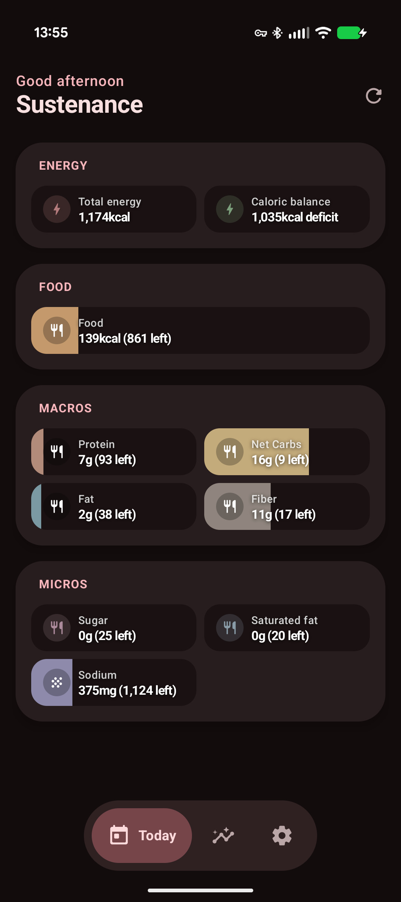
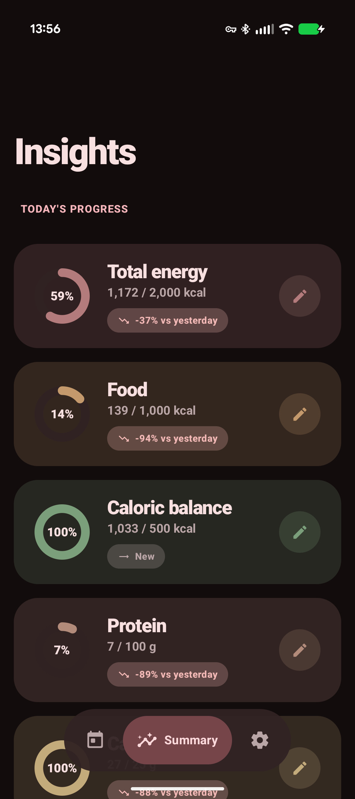
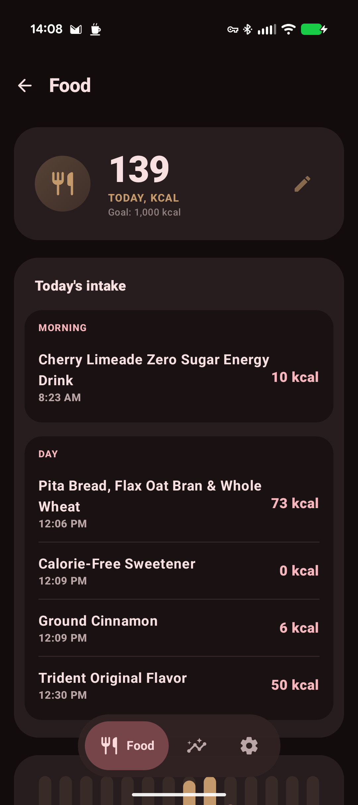

# Sustenance

A private, **read-only** [Health Connect](https://developer.android.com/health-connect)
viewer for Android, built with Jetpack Compose and Material You. Sustenance is focused
exclusively on tracking your nutritional and energy data—beautifully, and without
sending a single byte anywhere.

> No accounts. No network permission. No trackers. Just your food data, on your device.

---

## Gallery

|             Today Screen             |          Insights View          |         Food Details          |
|:-----------------------------------:|:-------------------------------:|:-----------------------------:|
|    |  |  |
|           *Today Screen*            |         *Insights View*         |        *Food Details*         |

---

## Features

- **Today**, Material You cards for calories, macronutrients (Protein, Carbs, Fat),
  and micronutrients (Fiber, Sodium, Sugar), each with current progress vs your goal.
- **Detail views**, full charts, statistics and recent records per nutrient.
- **Weekly summary**, daily averages vs. goals you set, with progress rings and
  week-over-week trends.
- **Home-screen widgets**, key nutrition metrics, dynamically themed (Glance + Material 3).
- **Export**, save your accessible data to CSV or JSON via the system file picker.

## Tech

- Kotlin, Jetpack Compose, Material 3 (dynamic color)
- `androidx.health.connect:connect-client` for all nutrition and energy reads
- `androidx.glance` widgets, WorkManager for periodic refresh
- DataStore for goals
- `minSdk 30`, `targetSdk 36`

## Privacy

Sustenance requests only Health Connect **read** permissions for Nutrition and Energy, holds
no network permission, and never transmits data. You control which data types it can read from
Health Connect at any time.

## Credits
Special thanks to **GuyOnWifi** for the original [/heartwood](https://github.com/GuyOnWifi/heartwood) base code which this project is built upon.

## License

[GPL-3.0-or-later](LICENSE) © Eason Huang
