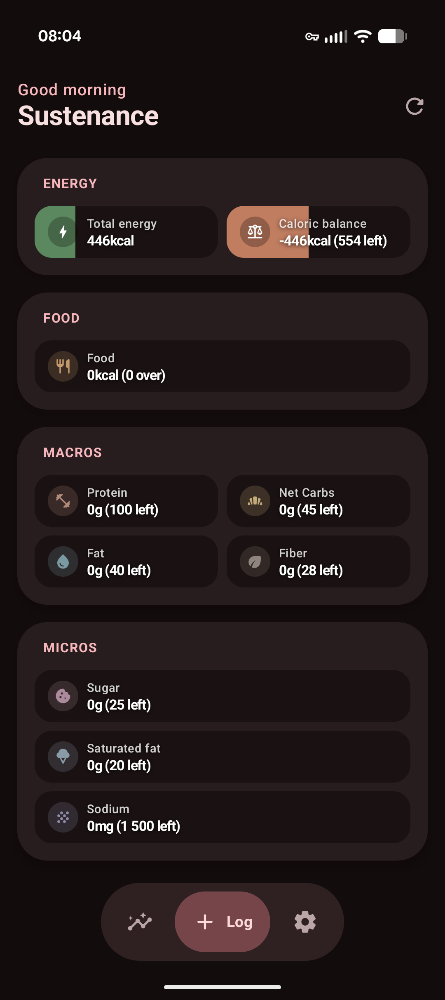
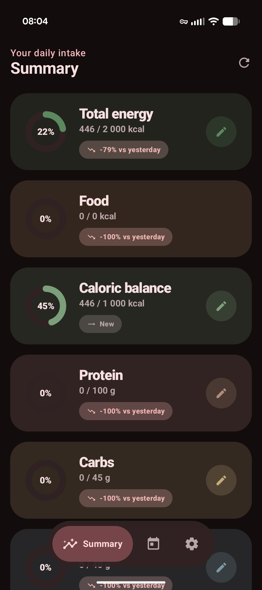
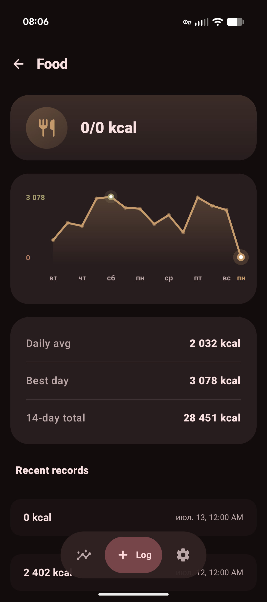
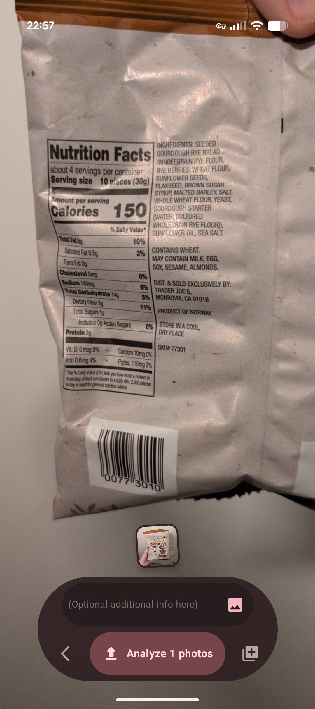
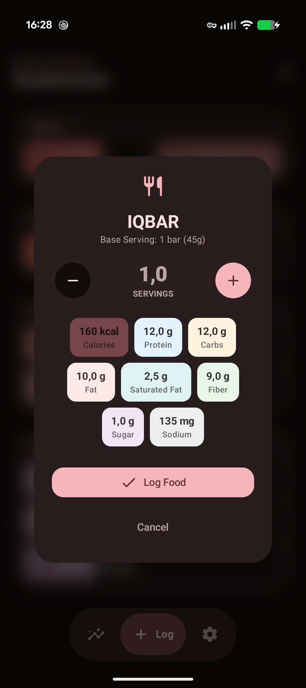

# Sustenance

A private, local nutrition tracker for Android, powered by [Health Connect](https://developer.android.com/health-connect).

By default, Sustenance is read-only and beautifully displays your Health Connect data with
customizable goals.

And if you supply an AI Studio API key, Sustenance can talk to Gemini to log data, too.

---

## Gallery

|             Today Screen             |          Insights View          |         Food Details          |
|:-----------------------------------:|:-------------------------------:|:-----------------------------:|
|    |  |  |

---

## Features
- **Home**: view your daily progress with context-aware greetings and helpful chips.
- **Summary**: daily averages vs. goals you set, with progress rings and
  comparison to yesterday.
- **Pull-to-Yesterday**: pull up from the dashboard to quickly view previous days.

## Food logging

By adding a [Google AI Studio-formatted API key](https://aistudio.google.com/app/api-keys), Sustenance is
able to analyze photos of food items and write
relevant nutritional information to Health Connect.

|           Scan Item            |            Log Item             |
|:------------------------------:|:-------------------------------:|
|  |  |

It talks to [gemini-3.1-flash-lite](https://docs.cloud.google.com/gemini-enterprise-agent-platform/models/gemini/3-1-flash-lite) for speed and efficiency.

---

## Tech

- Kotlin, Jetpack Compose, Material 3 (dynamic color)
- `androidx.health.connect:connect-client` for all nutrition and energy reads
- `androidx.camera` for scanning, `androidx.glance` widgets
- WorkManager for periodic refresh, Predictive Back support
- DataStore for goals
- `minSdk 30`, `targetSdk 36`

## Privacy

Sustenance requests only Health Connect **read/write** permissions for Nutrition and Energy.
- By default, AI logging features are not used and must be explicitly enabled.

## Credits
Special thanks to **GuyOnWifi** for the [heartwood](https://github.com/GuyOnWifi/heartwood) project, from which Sustenance was forked.

## License

[GPL-3.0-or-later](LICENSE) © Eason Huang & draumaz
